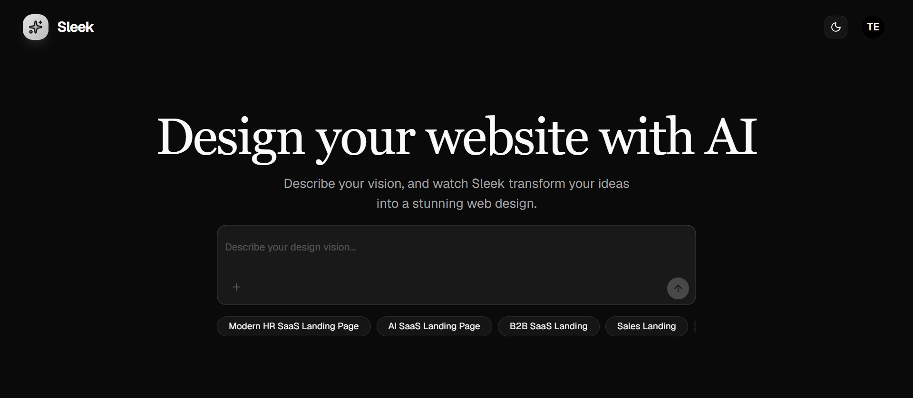
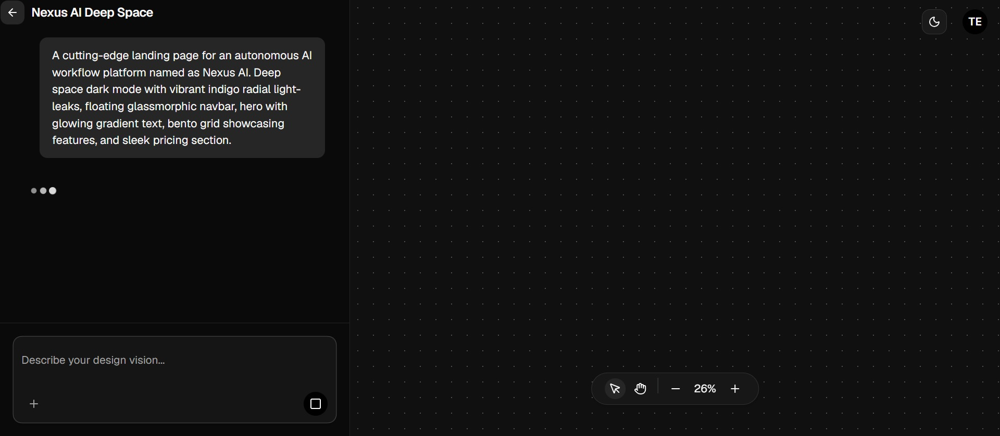
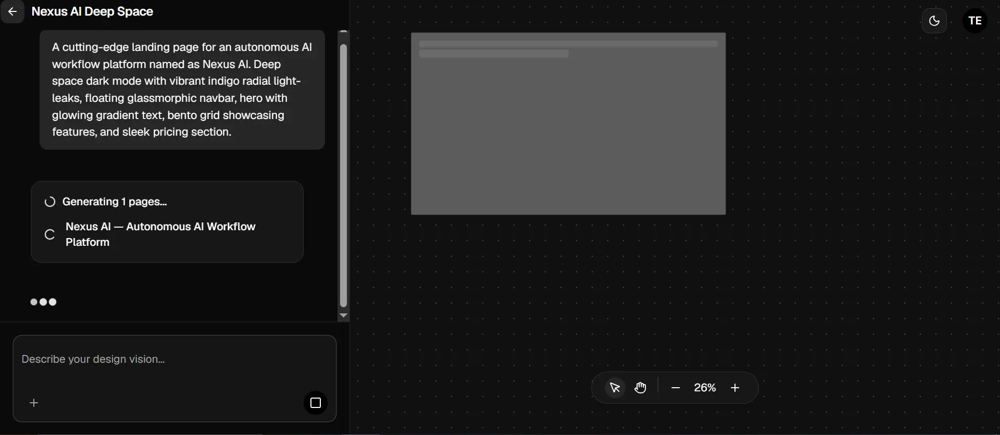
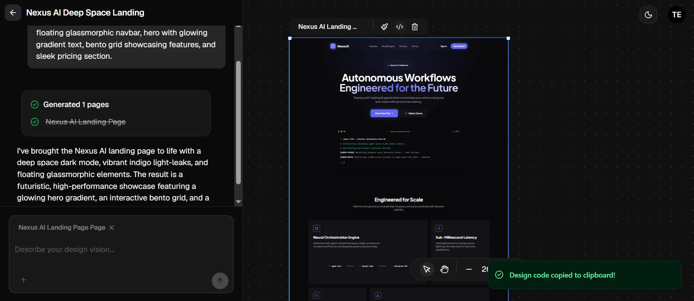
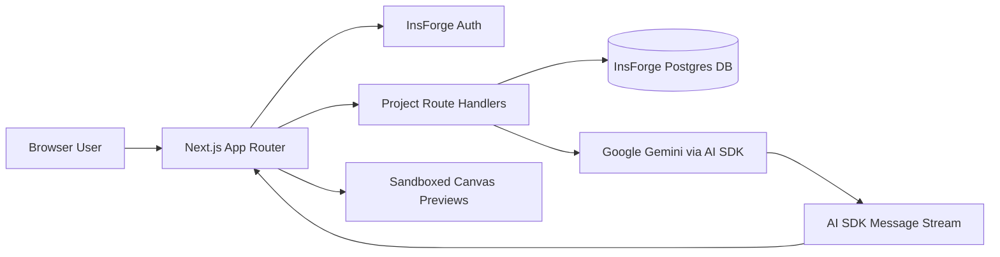

# Sleek Web-Design Agent

AI-powered web design workspace for turning natural-language briefs into responsive, editable website concepts on a persistent canvas.

Sleek helps designers and developers go from idea to multi-page interactive preview in seconds by combining natural language intent classification, automated HTML and CSS design token generation, and persistent workspace storage in a single product.

## Highlights

- Natural-language brief parsing into responsive multi-page layouts
- Interactive zoomable, pannable canvas with sandboxed preview frames
- Targeted selected-page regeneration and design token inspection
- Real-time streaming generation progress via AI SDK UI streams
- Persistent projects, page markup, and chat history powered by InsForge

## App Screens

### Product snapshots

#### Home page

<div align="center" style="margin: 18px 0 28px;">
  
</div>

#### Project title generation

<div align="center" style="margin: 18px 0 28px;">
  
</div>

#### Design generation

<div align="center" style="margin: 18px 0 28px;">
  
</div>

#### Project workspace

<div align="center" style="margin: 18px 0 28px;">
  
</div>

## Core Features

### 1. Multi-page site generation

- Parse natural language prompts into cohesive multi-page plans
- Generate responsive HTML using utility-first styling patterns
- Maintain visual harmony across pages using shared root CSS variables
- Inspect design tokens and copy production-ready code

### 2. Targeted regeneration & editing

- Select individual pages directly on the interactive canvas
- Apply surgical prompt edits without affecting unselected pages
- Reference existing design systems and tokens during modifications
- Real-time height measurement and sandbox safety

### 3. Interactive infinite canvas

- Pan, zoom, move, and resize page preview frames dynamically
- Isolated `iframe srcDoc` rendering prevents global style leakage
- Shareable URL parameters for active page selection state
- Custom frame sizing and responsive view testing

### 4. Persistent workspace & history

- Automatically generate concise project titles upon initial prompt
- Store full project structures, messages, and raw HTML pages
- Reopen projects and restore state seamlessly across sessions
- Ownership-aware Row Level Security (RLS) enforcement

## Architecture Overview



## Tech Stack

- Next.js 16 (App Router)
- React 19
- TypeScript
- Tailwind CSS 4
- InsForge Database & Auth (`@insforge/nextjs`, `@insforge/sdk`)
- Vercel AI SDK
- Google Gemini AI
- TanStack React Query
- Canvas Engine (`react-zoom-pan-pinch`, `react-rnd`, `nuqs`)

## Project Structure

```bash
app/                     # App Router pages, layouts, route handlers, server actions
components/chat/         # Chat orchestration, panel, input, and interactive canvas
components/ai-elements/  # Custom AI message and prompt primitives
components/ui/           # Shared UI primitives
hooks/                   # URL-backed canvas state hooks
lib/                     # Gemini integration, InsForge client, prompts, HTML wrappers
types/                   # Shared page and project TypeScript definitions
constants/                # Canvas interaction constants
public/                   # Static media assets and app screenshots
docs/                     # Architecture design specifications (HLD, LLD, HOW_IT_WORKS)
```

## App Setup

### 1. Install dependencies

```bash
npm install
```

### 2. Configure the environment

Copy the example file:

```bash
copy .env.example .env.local
```

Then fill in the required values for your InsForge and Google Gemini credentials.

### 3. Verify database setup

Ensure your InsForge Postgres instance includes the `projects`, `messages`, and `pages` tables with proper RLS policies configured.

### 4. Start the app

```bash
npm run dev
```

Open http://localhost:3000

## Environment Variables

Use `.env.local` with values from [.env.example](.env.example):

```env
NEXT_PUBLIC_INSFORGE_BASE_URL="https://<your-project>.insforge.app"
NEXT_PUBLIC_INSFORGE_ANON_KEY="your-insforge-anon-key"
GOOGLE_GENERATIVE_AI_API_KEY="your-google-ai-api-key"
```

## Common Commands

```bash
npm run dev
npm run build
npm run start
npm run lint
```

## Quality Assurance & Automation

Sleek incorporates rigorous end-to-end testing practices to ensure seamless workspace interaction, generation streaming, and rendering isolation.

- Verification covers authenticated routes, initial slug generation, and workspace loading
- Intent classification transitions (`chat`, `generate`, `regenerate`) are verified against Gemini schemas
- Frame message passing and isolated `srcDoc` rendering are evaluated under various responsive dimensions

This ensures reliable multi-page creation and canvas manipulation without introducing visual or state regressions.

## Documentation

- [docs/HLD.md](docs/HLD.md) - High-level system architecture and system boundaries
- [docs/LLD.md](docs/LLD.md) - Low-level module layout, event contracts, and data models
- [docs/HOW_IT_WORKS.md](docs/HOW_IT_WORKS.md) - Comprehensive step-by-step technical guides & flowcharts

## Notes

The application relies on valid runtime credentials for InsForge and Google Gemini-SDK. While public views operate independently, full AI page generation, chat streaming, and project persistence require properly initialized environment variables.
