# How Sleek Works Behind the Scenes

Complete guide with flowcharts, technology explanations, and database schema examples for every operation.

## Table of Contents

1. [All Technologies Explained](#all-technologies-explained)
2. [Authentication & Session Flow](#authentication--session-flow)
3. [Project Creation & Initial Prompt Flow](#project-creation--initial-prompt-flow)
4. [Design Generation Flow](#design-generation-flow)
5. [Targeted Page Regeneration Flow](#targeted-page-regeneration-flow)
6. [Conversational Chat Flow](#conversational-chat-flow)
7. [Canvas Rendering & Iframe Isolation](#canvas-rendering--iframe-isolation)

---

# All Technologies Explained

## 1. Next.js App Router

**What it is**: Full-stack React framework providing integrated server API routes, server actions, and UI layouts.

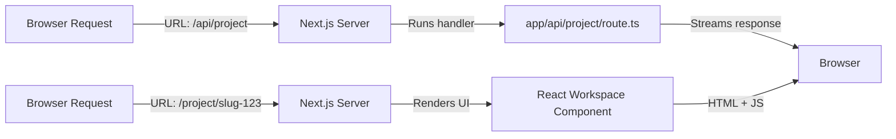

**In Sleek**:

- **API Routes**: Routes under `app/api/` manage project retrieval and AI streaming.
- **Server Actions**: Route logic like `deletePageAction` simplifies backend database calls.
- **Layouts**: Protected dashboard layouts enforce login session checks.

---

## 2. React & TypeScript

**React**: Manages reactive state across chat panels, canvas frames, and prompt controls.
**TypeScript**: Enforces strict structural boundaries for messages, design tokens, and database models.

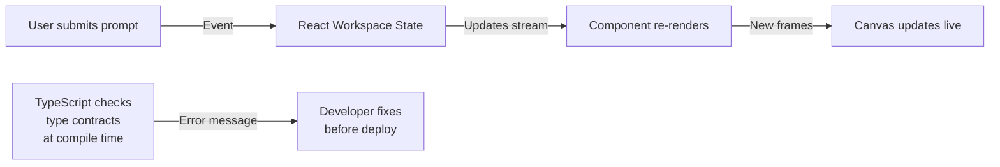

---

## 3. Tailwind CSS & shadcn/ui

**What it is**: Utility-first CSS framework for workspace styling and generated preview layout styling.

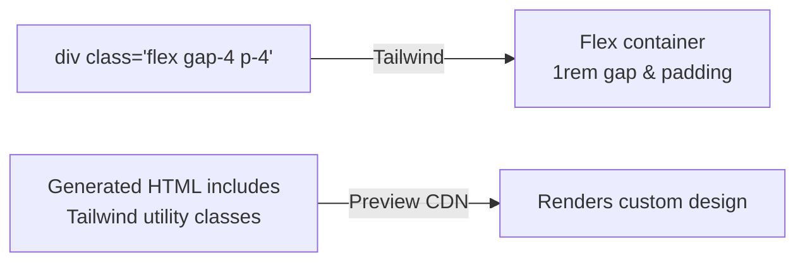

---

## 4. InsForge Auth & Postgres Database

**What it is**: Identity management system and Postgres database supporting Row Level Security (RLS).

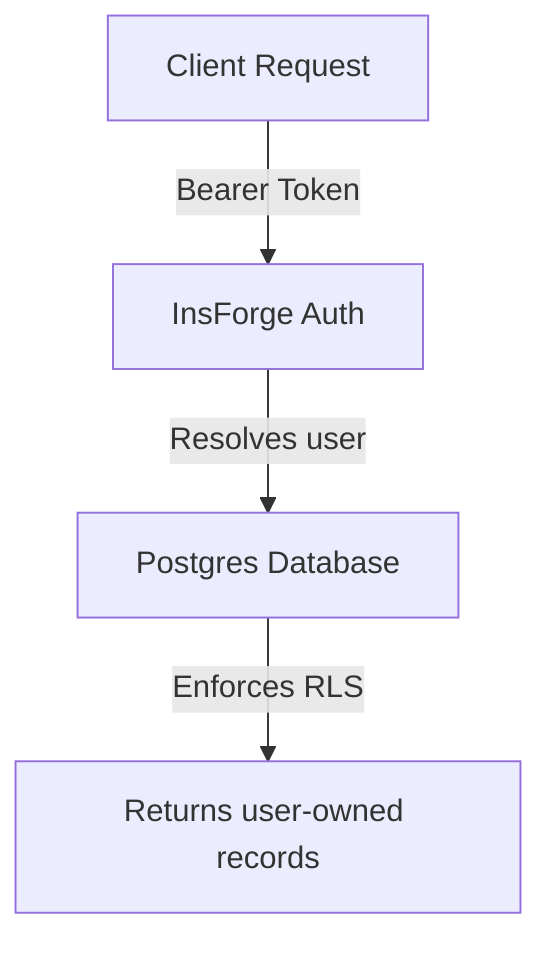

**In Sleek**:

- Stores `projects`, `messages`, and `pages` records.
- RLS policies ensure users can only access their own web design projects.

---

## 5. Vercel AI SDK & Google Gemini

**What it is**: Streaming AI library connecting Next.js server handlers to Google Gemini LLM engines.

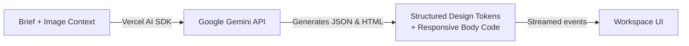

**In Sleek**:

- Executes intent classification (`chat`, `generate`, `regenerate`).
- Generates structured CSS root variable definitions and HTML body code.
- Streams text deltas and data events simultaneously.

---

## 6. Infinite Canvas Stack (react-zoom-pan-pinch, react-rnd, nuqs)

**What it is**: Interactive canvas environment enabling smooth panning, zooming, resizing, and URL parameter management.

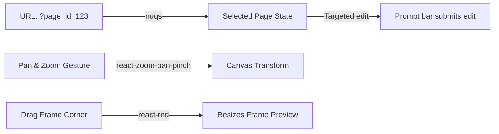

---

# Detailed Flows with Database Schemas

---

## Authentication & Session Flow

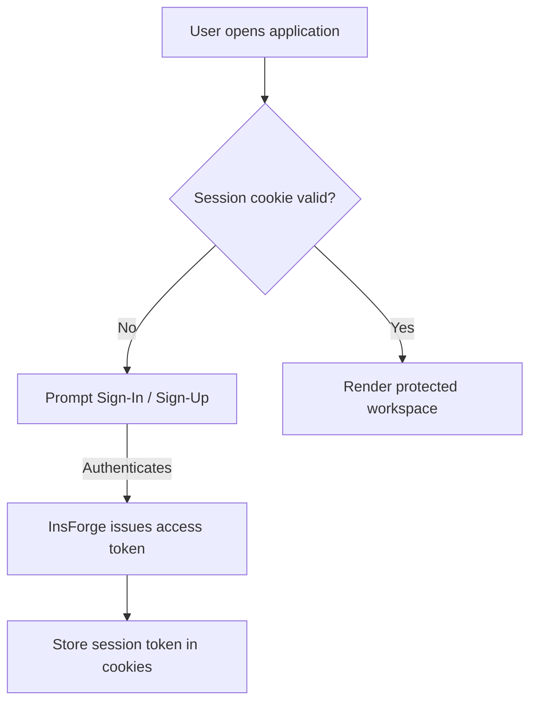

### Database Entities:

```javascript
// ============================================
// projects table
// ============================================
{
  id: "proj_987f6e5d-4c3b-2a10-9876-543210fedcba",
  userId: "user_12345678-abcd-ef01-2345-6789abcdef01",
  slugId: "sleek-portfolio-x82k",
  title: "Modern Minimalist Portfolio",
  created_at: "2026-09-01T10:00:00.000Z"
}
```

---

## Project Creation & Initial Prompt Flow

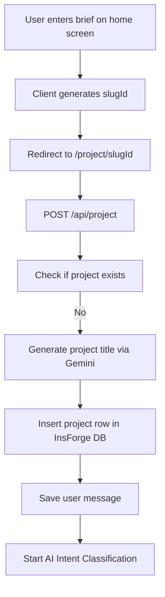

### Database Row Creation:

```javascript
// ============================================
// Inserted into messages table
// ============================================
{
  id: "msg_11111111-2222-3333-4444-555555555555",
  projectId: "proj_987f6e5d-4c3b-2a10-9876-543210fedcba",
  role: "user",
  parts: [
    {
      type: "text",
      text: "Create a 2-page website for a sleek dark-themed coffee shop."
    }
  ],
  created_at: "2026-09-01T10:00:01.000Z"
}
```

---

## Design Generation Flow

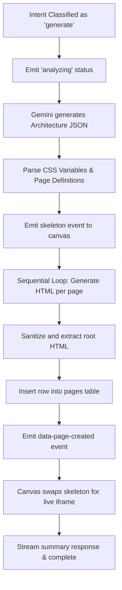

### Database Row Insertion (`pages` table):

```javascript
// ============================================
// Inserted into pages table
// ============================================
{
  id: "page_aaaa1111-bb22-cc33-dd44-eeee55556666",
  projectId: "proj_987f6e5d-4c3b-2a10-9876-543210fedcba",
  name: "Home",
  rootStyles: ":root { --background: #0a0a0a; --foreground: #ffffff; --primary: #d4a373; }",
  htmlContent: "<div class=min-h-screen bg-background text-foreground><header class=p-6 flex justify-between><h1 class=text-2xl font-bold text-primary>Roast & Steam</h1></header></div>",
  created_at: "2026-09-01T10:00:05.000Z"
}
```

---

## Targeted Page Regeneration Flow

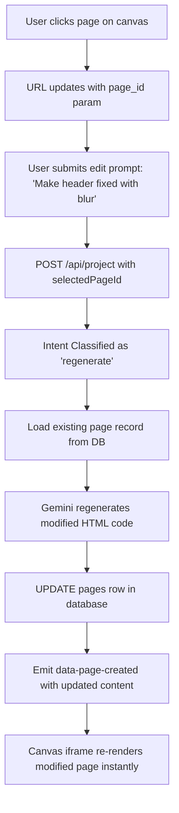

### Database Row Update (`pages` table):

```javascript
// ============================================
// UPDATE on pages table
// ============================================
// BEFORE:
// htmlContent: "<div class=min-h-screen><header class=p-6>...</header></div>"

// AFTER:
// htmlContent: "<div class=min-h-screen><header class=fixed top-0 w-full backdrop-blur-md p-6>...</header></div>"
```

---

## Conversational Chat Flow

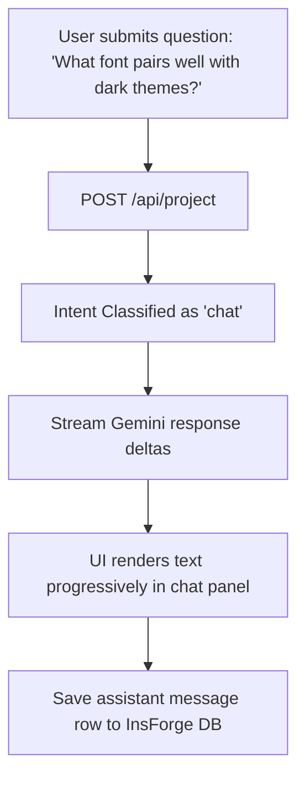

---

## Canvas Rendering & Iframe Isolation

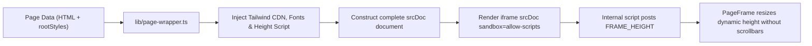

---

## Technology Stack Summary

| Component               | Technology                           | Purpose                     | In Sleek                    |
| ----------------------- | ------------------------------------ | --------------------------- | --------------------------- |
| **Frontend Framework**  | React 19 + Next.js 16                | UI rendering & API routes   | Workspace UI & APIs         |
| **Language**            | TypeScript                           | Static type safety          | All files                   |
| **Styling**             | Tailwind CSS 4                       | UI and generated styling    | Components & generated code |
| **Database & Auth**     | InsForge (Postgres)                  | Session & data persistence  | Users, projects, pages      |
| **AI Processing**       | Google Gemini via Vercel AI SDK      | Design generation & chat    | Prompt processing API       |
| **State Management**    | TanStack React Query + `nuqs`        | Fetch caching & URL params  | Project query & selection   |
| **Canvas Manipulation** | `react-zoom-pan-pinch` + `react-rnd` | Pan, zoom, move, and resize | Infinite visual canvas      |

---

## Best Practices Shown

1. **Always authenticate**: Secure protected workspace views and verification headers on API routes.
2. **Isolate untrusted output**: Render generated HTML inside sandboxed iframes using `srcDoc` and `sandbox="allow-scripts"`.
3. **Optimistic & real-time feedback**: Utilize AI SDK UI message streams for continuous live status events.
4. **Targeted AI execution**: Use intent classification to separate heavy multi-page layout generation from surgical single-page updates or chat responses.
5. **Enforce data integrity**: Postgres RLS policies ensure dynamic user data separation across database transactions.

---

Now you understand how every piece of Sleek Web-Design Agent works together! 🚀
