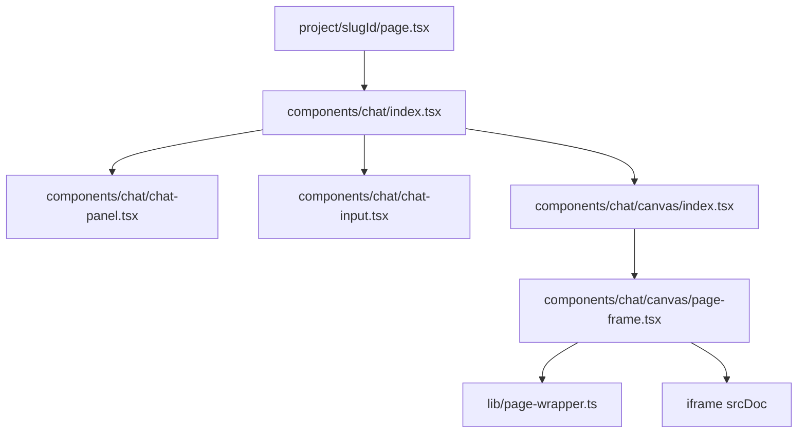

# Low-Level Design (LLD)

## 1. Module Inventory

### Frontend Modules

- public landing view under `app/page.tsx`
- protected workspace layout under `app/(routes)/(dashboard)/layout.tsx`
- workspace page boundary under `app/(routes)/(dashboard)/project/[slugId]/page.tsx`
- canvas components under `components/chat/canvas/*` (`page-frame`, `canvas-toolbar`, `token-inspector`)
- chat components under `components/chat/*` (`chat-interface`, `chat-panel`, `chat-input`)

### Shared Components

- ui: reusable primitives such as `button`, `card`, `input`, `dialog`, `tooltip`
- ai-elements: custom AI streaming indicators and prompt primitives
- hooks: `useCanvas` for managing shareable URL parameter state via `nuqs`

### Backend Modules

- `app/api/auth/route.ts`: InsForge auth delegation route
- `app/api/project/route.ts`: primary project creation, listing, classification, and stream handler
- `app/api/project/[slugId]/route.ts`: project history fetch route
- `app/action/action.ts`: server actions (e.g., `deletePageAction`)
- `lib/insforgeServer.ts` & `lib/insforgeClient.ts`: server and client database SDK wrappers
- `lib/gemini.ts`: Google Gemini AI SDK client configuration
- `lib/prompt.ts`: master system prompts for intent, analysis, generation, and chat
- `lib/page-wrapper.ts`: HTML document wrapper and iframe height script builder

## 2. Request Processing Details

### 2.1 Project Query and Creation API

File: `app/api/project/route.ts`

Flow:

1. Authenticate session using `getAuthServer()`; return `401` if unauthenticated.
2. For `GET` requests, fetch up to 10 projects owned by the user, ordered by `created_at` descending.
3. For `POST` requests, parse the body payload (`messages`, `slugId`, `selectedPageId`).
4. Query the InsForge database for a project matching `slugId`.
5. If missing, invoke Gemini to synthesize a concise project title, then create the project record linked to `userId`.
6. Persist the incoming user message to the `messages` table.
7. Construct the AI SDK UI message stream, emit a project title data event (`data-project-title`), and execute intent classification.

**Note:** Every request is gated behind an authenticated InsForge session before any database write occurs.

### 2.2 Project Details API

File: `app/api/project/[slugId]/route.ts`

Flow:

1. Validate route params and authenticate the user session via InsForge.
2. Fetch the project row matching `slugId`.
3. If not found, return `404 Not Found`.
4. Fetch associated `messages` and `pages` ordered chronologically.
5. Return a structured JSON payload containing `{ title, messages, pages }`.

**Status:** Row Level Security is **active and enforced** on all read paths, so cross-user reads are rejected at the database layer regardless of route-level checks.

## 3. Intent & AI Pipeline Design

### 3.1 Intent Classification

System Prompt: `INTENT_PROMPT` in `lib/prompt.ts`

Evaluates prompt context and determines the execution path:

- `chat`: conversational questions, brainstorming, explanations
- `generate`: requests to build new pages or redesign the entire site
- `regenerate`: explicit edits targeted at an active `selectedPageId`

### 3.2 Design Generation Pipeline

System Prompts: `WEB_ANALYSIS_PROMPT`, `HTML_GENERATION_PROMPT`

Sequence:

1. Emit a `data-generation` event with status `analyzing`.
2. Query Gemini with the user request and any attached reference imagery.
3. Parse structured JSON containing layout architecture, root CSS variables (`rootStyles`), and page definitions.
4. Emit a `data-pages-skeleton` event reserving canvas loading frames.
5. For each defined page:
   - Generate raw responsive HTML using `HTML_GENERATION_PROMPT`.
   - Clean markdown code fences and sanitize root `div` structures.
   - Save the page row (`name`, `rootStyles`, `htmlContent`, `projectId`) to the database.
   - Emit a `data-page-created` event to swap the loading skeleton with a live iframe frame.
6. Emit a completion state and stream a conversational summary to the user.

### 3.3 Page Regeneration Pipeline

Sequence:

1. Require a valid `selectedPageId` and load the target page row from the database.
2. Emit `data-page-loading` and `data-generation` with status `regenerating`.
3. Pass the prompt edit request along with the existing page `htmlContent` and `rootStyles` to Gemini.
4. The model generates a modified, complete page document.
5. Update the database record for the target page ID.
6. Emit an updated `data-page-created` event and summary text.

## 4. Database Schema Details

Managed via the InsForge Postgres engine:

### `projects` Table

- `id`: UUID (Primary Key)
- `userId`: UUID (Foreign Key)
- `slugId`: Text (Unique index)
- `title`: Text
- `created_at`: Timestamp

### `messages` Table

- `id`: UUID (Primary Key)
- `projectId`: UUID (Foreign Key -> `projects.id`)
- `role`: Text (`user` | `assistant`)
- `parts`: JSONB (AI SDK message structure)
- `created_at`: Timestamp

### `pages` Table

- `id`: UUID (Primary Key)
- `projectId`: UUID (Foreign Key -> `projects.id`)
- `name`: Text
- `rootStyles`: Text (CSS variable declarations)
- `htmlContent`: Text (Raw HTML body markup)
- `created_at`: Timestamp

## 5. Frontend State Model

The app uses a mixture of server-side state and client-side React Query state.

### Canvas Interaction State

- `selectedPageId`: managed in a URL query parameter (`?page_id=...`) via `nuqs`.
- Frame position, width, height, pan, and zoom: managed locally by `react-rnd` and `react-zoom-pan-pinch`.

### Workspace Query State

- TanStack React Query handles project data fetching via `/api/project/[slugId]`.
- A single-hydration guard ensures streamed messages update locally without being overwritten by background refetches.

### Stream UI Handling

- The AI SDK `useChat` hook consumes the stream from `/api/project`.
- A custom event parser listens for custom data events (`data-page-created`, `data-generation`, etc.) to trigger live canvas re-renders.

## 6. Preview Assembly & Wrapping

File: `lib/page-wrapper.ts`

To ensure safe rendering inside an `iframe srcDoc`:

1. Injects root CSS variables (`rootStyles`) into the standard document `<head>`.
2. Loads CDN dependencies: Tailwind CSS, Google Fonts, Iconify icons.
3. Wraps body markup inside sanitized root containers.
4. Appends a script measuring inner element scroll height and posting `FRAME_HEIGHT` messages to the parent window.
5. The frame component adjusts iframe height dynamically to eliminate inner scrollbars.

## 7. Security and Validation Rules

- **Authentication**: All API requests validate headers against InsForge Auth.
- **Authorization**: Row Level Security (RLS) policies enforce database access constraints.
- **Rendering Isolation**: `iframe` elements use `sandbox="allow-scripts"` without `allow-same-origin`.
- **API Protection**: `GOOGLE_GENERATIVE_AI_API_KEY` is kept strictly isolated on server environments.

## 8. Error Handling Strategy

There are three relevant classes of errors:

1. validation errors from client input
2. runtime errors from external services such as Gemini
3. streaming or generation failures mid-pipeline

The app handles these by:

- returning `400` for invalid requests
- returning `401` for unauthenticated users
- returning `404` for missing project records
- aborting the generation sequence cleanly on malformed AI output rather than persisting invalid pages
- surfacing transport and generation errors via toast notifications while preserving already rendered canvas frames

## 9. Component Relationships

### Routing Structure

- root route: landing page
- workspace route: protected project canvas and chat interface

### UI Composition Flow

- `WorkspacePage` initializes state and fetches project data
- `ChatInterface` composes the chat panel, chat input, and canvas
- `Canvas` renders `PageFrame` instances, one per generated page
- `PageFrame` wraps content via `lib/page-wrapper.ts` and renders the sandboxed iframe

## 10. Notable Risks and Follow-ups

- canvas layout state (pan, zoom, frame position) is local only and does not persist across sessions or devices
- generation pipeline has no automatic retry on partial Gemini failures mid-sequence
- reporting and observability for streaming/generation failures should be strengthened
- InsForge and Gemini credentials must be fully configured before production use

## 11. Summary

The low-level design follows a clean layered architecture: UI → API → intent classification → AI generation pipeline → persistent data model → sandboxed canvas rendering. This architecture is appropriate for a design-generation SaaS product that needs fast iterative AI feedback loops without compromising rendering safety or data isolation.
